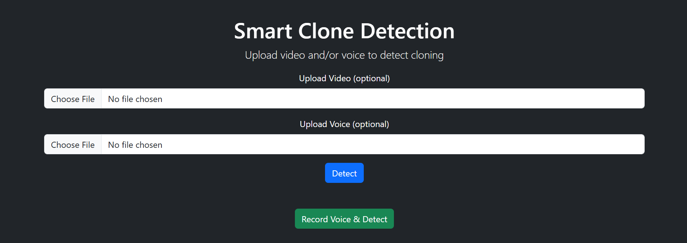

# 🔐 Smart Clone Detection (Multimodal: Video + Voice)

This project detects whether a person is real or a deepfake clone using both **video (face)** and **voice** authentication. It integrates **computer vision**, **audio signal processing**, and **machine learning** to provide a robust identity verification system.

---


## 📁 Datasets Used

### 🎤 Audio Dataset (Voice DeepFake)
- **Source**: [Deep Voice Fake Recognition Dataset - Kaggle](https://www.kaggle.com/datasets/birdy654/deep-voice-deepfake-voice-recognition)
- **Content**: Real and synthetic audio clips of various individuals.
- **Used for**: Voice-based authentication using MFCCs and Logistic Regression.

### 🎥 Video Dataset (Face DeepFake)
- **Source**: [DeepFake Detection Cropped Dataset - Kaggle](https://www.kaggle.com/datasets/ucimachinelearning/deep-fake-detection-cropped-dataset)
- **Content**: Cropped facial video clips of real and fake subjects.
- **Used for**: Facial verification using CNN with TensorFlow/Keras.

---

## 🚀 Features
- 🔎 Detects whether the user is a real person or a clone using face and voice data.
- 🎙️ Captures and classifies audio via a trained logistic regression model.
- 📸 Captures and analyzes video in real-time using a trained deep learning model.
- 🌐 Flask-powered web interface for integrated verification.

---

## 🧠 Tech Stack

| Type | Libraries |
|------|-----------|
| Deep Learning | TensorFlow, Keras |
| Audio Processing | Librosa, SoundDevice, NumPy |
| Computer Vision | OpenCV |
| Machine Learning | Scikit-learn, joblib |
| Web Framework | Flask |
| Utilities | os, glob, pickle |

---

## 🛠️ Installation

1. **Clone the repository:**
   ```bash
   git clone https://github.com/aky-ds/Smart_DeepFake_Detector.git
   cd SmartCloneDetection
